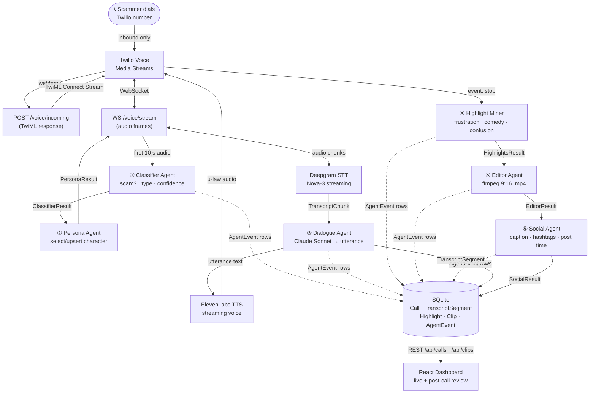
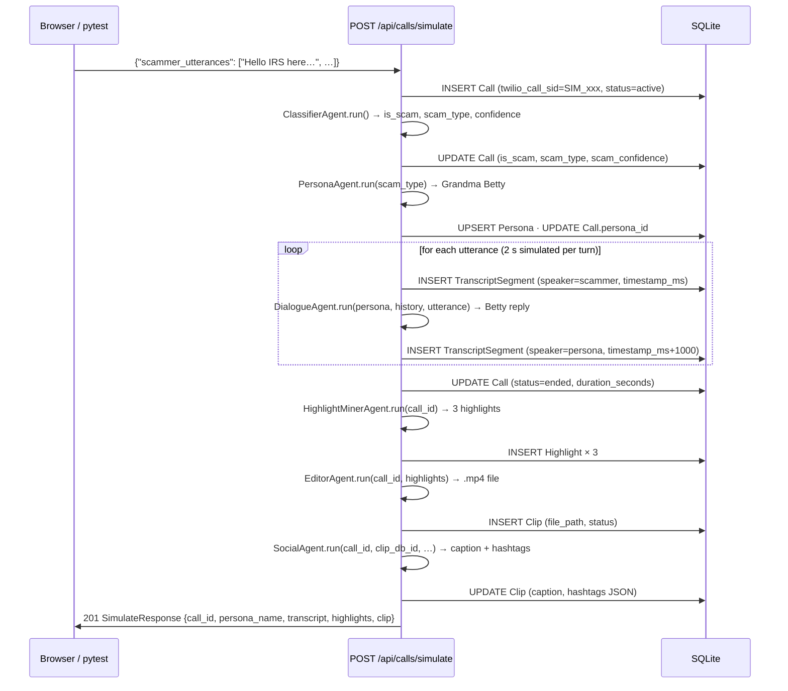

# ScamSlayer — Agentic Architecture

## Overview

ScamSlayer is a six-agent pipeline. Agents are Python classes with a single `async run()` method that returns a typed Pydantic result and writes an `AgentEvent` row for dashboard replay. The pipeline can be exercised two ways:

1. **Live call** — Twilio dials in, audio streams over WebSocket, agents fire in real time.
2. **Simulate** — `POST /api/calls/simulate` runs the full pipeline from scripted utterances with no phone required. Used for demos and CI.

---

## Live Call Flow



---

## Simulate Flow



---

## Agent Contracts

Every agent follows the same interface pattern:

```python
class XxxAgent:
    def __init__(self, db: AsyncSession) -> None: ...

    async def run(self, call_id: int, ...) -> XxxResult:
        # 1. do work (mock or real)
        # 2. write AgentEvent to DB
        # 3. return typed Pydantic result
```

| Agent | Class | Result type | Mock behaviour |
|---|---|---|---|
| **Classifier** | `ClassifierAgent` | `ClassifierResult` | `{is_scam: True, confidence: 0.87, scam_type: "irs_impersonation"}` |
| **Persona** | `PersonaAgent` | `PersonaResult` | Upserts Grandma Betty (age 78, voice `EXAVITQu4vr4xnSDxMaL`, retired schoolteacher) |
| **Dialogue** | `DialogueAgent` | `DialogueResult` | Cycles `fixtures/betty_responses.json` (13 stall lines); real path calls Claude Sonnet |
| **Highlight Miner** | `HighlightMinerAgent` | `HighlightsResult` | 3 templates (frustration 0.87, comedy 0.91, confusion 0.94); uses real transcript snippets when available |
| **Editor** | `EditorAgent` | `EditorResult` | `ffmpeg` → 1-second black `.mp4`; falls back to empty file if ffmpeg missing |
| **Social** | `SocialAgent` | `SocialResult` | Caption from top-score highlight; 8 hardcoded hashtags (`#scambaiting` … `#fyp`) |

Toggle `MOCK_CLAUDE=false` + set `ANTHROPIC_API_KEY` to get real Claude dialogue. All other mocks remain active until the corresponding service keys are provided.

---

## Database Schema

```
Persona
  id · name · backstory · speech_tics
  elevenlabs_voice_id · scam_types (JSON array)

Call
  id · twilio_call_sid · caller_number · status
  is_scam · scam_confidence · scam_type
  duration_seconds · started_at · ended_at
  persona_id  →  Persona

TranscriptSegment
  id · call_id → Call
  speaker ("scammer" | "persona") · text
  timestamp_ms · is_final · confidence

Highlight
  id · call_id → Call
  start_ms · end_ms · reason · score · transcript_snippet

Clip
  id · call_id → Call · file_path
  duration_seconds · caption · hashtags (JSON) · status

AgentEvent
  id · call_id → Call
  agent · event_type · payload (JSON) · created_at
```

Each `Call` has many `TranscriptSegment`, `Highlight`, `Clip`, and `AgentEvent` rows. It belongs to one `Persona` (nullable until `PersonaAgent` runs).

---

## REST API

All routes are mounted under `/api` by `main.py`.

```
POST /api/calls/simulate          run full 6-agent pipeline from scripted utterances
GET  /api/calls                   list calls (newest first, with highlight count + clip ID)
GET  /api/calls/{id}              full call detail — transcript, highlights, clip embedded
GET  /api/calls/{id}/clip         stream the .mp4 file (FileResponse)
GET  /api/calls/{id}/transcript   ordered transcript segments
GET  /api/calls/{id}/highlights   highlights sorted by score desc
GET  /api/calls/{id}/events       agent event log for timeline replay

GET  /api/personas                list all personas
GET  /api/personas/{id}           single persona
POST /api/personas                create persona
PUT  /api/personas/{id}           update persona
DELETE /api/personas/{id}         delete persona

GET  /api/clips                   list all clips
GET  /api/clips/{id}              single clip
POST /api/clips/{id}/generate     mine highlights + assemble clip for an existing call

POST /voice/incoming              Twilio webhook — returns TwiML <Connect><Stream>
WS   /voice/stream                Twilio Media Streams WebSocket

GET  /health                      liveness probe → {"status": "ok"}
```

---

## WebSocket Protocol (Twilio ↔ Backend)

Twilio sends JSON frames on `WS /voice/stream`:

```json
{ "event": "connected" }
{ "event": "start",  "start": { "callSid": "CA…", "streamSid": "MZ…" } }
{ "event": "media",  "media": { "payload": "<base64 μ-law 8kHz>" } }
{ "event": "stop" }
```

The backend streams TTS audio back:

```json
{ "event": "media", "streamSid": "MZ…", "media": { "payload": "<base64 μ-law 8kHz>" } }
```

Audio format: **8 kHz μ-law (G.711), 20 ms frames** — Twilio's native format for Media Streams.

---

## Configuration (`backend/app/config.py`)

| Env var | Default | Effect |
|---|---|---|
| `MOCK_CLAUDE` | `true` | Dialogue Agent cycles fixture lines instead of calling Claude |
| `MAX_CALL_DURATION_SECONDS` | `300` | Hard hangup enforced in WebSocket handler |
| `LOG_LEVEL` | `INFO` | Python logging level |
| `DATABASE_URL` | `sqlite+aiosqlite:///./scamslayer.db` | Swap to `postgresql+asyncpg://…` for Postgres |
| `NGROK_URL` | — | Added to CORS `allow_origins` list when set |

---

## Deployment Target (Fly.io)

```
fly launch                         # scaffold fly.toml
fly redis create                   # managed Redis for arq background jobs
fly secrets set \
  ANTHROPIC_API_KEY=sk-ant-… \
  TWILIO_ACCOUNT_SID=AC… \
  TWILIO_AUTH_TOKEN=… \
  DEEPGRAM_API_KEY=… \
  ELEVENLABS_API_KEY=… \
  MOCK_CLAUDE=false
fly deploy
```

The `Dockerfile` runs `uvicorn backend.app.main:app --host 0.0.0.0 --port 8080`. The React frontend is built at deploy time and served as static files from `StaticFiles("/", directory="frontend/dist")`.
