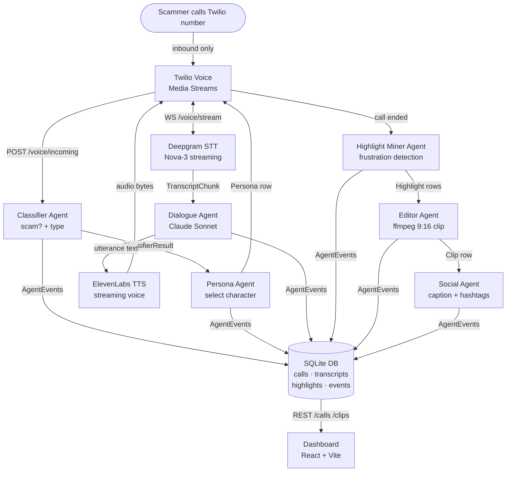

# ScamSlayer — Agentic Architecture

## End-to-End Flow



## Agent Responsibilities

| Agent | Trigger | Inputs | Outputs | Status |
|---|---|---|---|---|
| Classifier | Incoming call | caller metadata | ClassifierResult | Mock |
| Persona | Post-classification | scam_type | Persona row | Mock |
| Dialogue | Each STT chunk | transcript + history | utterance text | Partial (Claude wired) |
| Highlight Miner | Call ended | transcript rows | Highlight rows | Mock |
| Editor | Post-highlights | highlights + audio | Clip row | Stub |
| Social | Post-editor | clip + call + highlights | caption + hashtags | Mock |

## Data Flow — DB Tables

```
Call ──┬── Transcript (many)
       ├── Highlight (many)
       ├── Clip (many)
       ├── AgentEvent (many)  ← full audit log
       └── Persona (FK)
```

## WebSocket Protocol (Twilio → Backend)

Twilio sends JSON frames over the WS:
- `{"event": "connected"}` — stream established
- `{"event": "start", "start": {...}}` — call metadata
- `{"event": "media", "media": {"payload": "<base64-mulaw>"}}` — audio chunk
- `{"event": "stop"}` — call ended

Backend streams TTS audio back as base64-encoded mulaw in `{"event": "media"}` frames.
